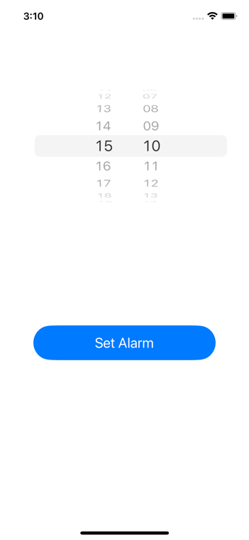
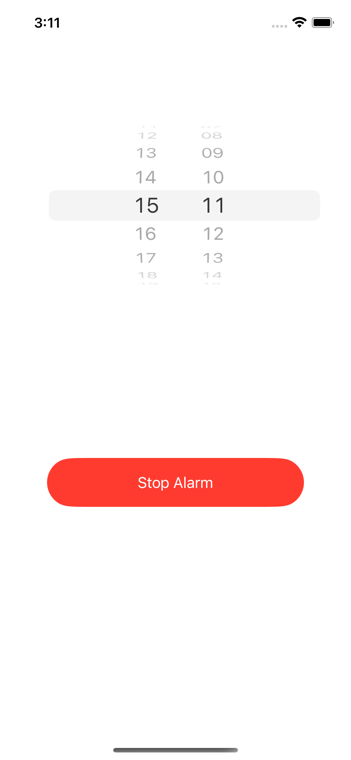

# AlarmApp
A Simple Alarm App

## Introduction:

This app is a basic alarm clock app. After you choosing hour and minute and tap the Set-Alarm button, alarm is settled and at alarm time you should open the app and make sure to silence alarm. 

## Screens of the App

  In this screenshot below you can see the home screen for pick time and **Set Alarm** button. 
  
  
   

  Secondly if your alarm is ringing the button changes to red and stands for the alarm to **Stop**.
  
   
   
